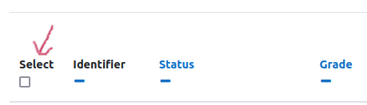

# Moodle: Customized assignments

<style>
div.note { background-color:#e6f0ff; border-radius: 5px; padding: 20px; }
</style>

This guide shows how to create assignments where each participant receives a 'customized' assignment tailored to that student.

This is a total **HACK** of Moodle. Students are delivered their assignment via the 'Feedback Files' section of an assignment. You then manually switch the marking workflow to 'release' the feedback files (i.e., exam papers) to students when the exam begins.

## Set up a new assignment

Under *Feedback types* select only "Feedback files".

Under *Common module settings* select "Hide from students" so that students cannot see it while you are configuring it. You can show it to students when it is completed.

<div class="note">
**IMPORTANT**: Set up the activity with "Marking Workflow = Yes", otherwise the exam will be visible to students in the Gradebook before the exam period.
</div>

## Upload feedback files

We are going to upload the assignments as 'feedback files' for the assignment you just created. But first we have to get the student identities through the 'Assignment submission report.'

On the course page, click the cog icon at the top, and select "More...".

Under course administration, go to the "Reports" tab and select "Assignment submission report." Find the assignment and click "Export". This gives you a spreadsheet with all of the unique Participant IDs used in blind marking.

You will need to create a subdirectory that itself contains one subdirectory per student (participant) with the student folders labeled using the convention `Participant_102230754_assignsubmission_file_`. Here is an R script with a function `feedback_folders()` that will do this for you based on the participant IDs in the file you just downloaded (`assign.xlsx`).

```{r feedback-folders, eval=FALSE}
feedback_folders <- function(assign_file, subdir = "feedback_folders",
                             overwrite = FALSE) {
  if (dir.exists(subdir)) {
    if (!overwrite) {
      stop("'", subdir, "' exists and overwrite is FALSE")
    } else {
      unlink(subdir, TRUE, TRUE)
    }
  }
  dir.create(subdir)

  dat <- readxl::read_excel(assign_file, skip = 3L)
  fnames <- sapply(dat[["Username"]], function(.x) {
    paste0(sub("\\s", "_", .x), "_assignsubmission_file_")
  })

  lapply(fnames, function(.x) {
    dir.create(file.path(subdir, .x))
  })
  NULL
}
```

Put each student's individual assignment in the corresponding folder. Then make a ZIP archive of all of these subfolders.

In the course Moodle page, click on the link for the assignment you just created, and then choose "View all submissions." Then under Grading Action choose "Upload multiple feedback files in a zip."

## Release the exam

At the exam start time, you have to release the feedback files so that students can access them. You could either just go into edit settings and change Marking Workflow to "No" and save the changes (easy, but not recommended by our teaching admin staff because it is not 'auditable'). So here is the way they recommend instead.

Click on the assignment and go to "View all submissions".

Now select all of the assignments by clicking the checkbox in the header row (see below).



Go to the bottom of the screen and find the drop down box *With selected...* and select *Set marking workflow state*. Click Go and the OK in the popup box.

You will see a screen that says "Set marking workflow state for XXX users."

At the bottom of that screen, there is a dropdown titled "Marking workflow state."  Set this to Released, and leave Notify students at "No". Save changes.

The exam paper will now be available to students.
